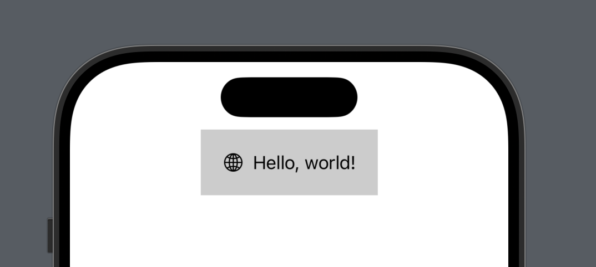

# CodableUI

A proof-of-concept that creates a `Codable` structure that mirrors basic SwiftUI views and conforms those types to `View`. This could be used to display dynamic SwiftUI views in an app via a `Codable` JSON structure from a remote server without updating the app.

This is done without type erasure by using enums with associated values.

## Basic example

``` swift
var basicCodableView: CodableView {
  .content(
    .hStack(
      .children([
        .content(.image(.systemName("globe"))),
        .content(.text("Hello, world!"))
      ])
    ),
    modifiers: [
      .padding(.all(20)),
      .backgroundColor(.white(0.8))
    ]
  )
}
```

This defines a `CodableView` with its `content` defined as an `.hStack` with two children: one `.image` with a SF symbol of `globe` and one `.text` with the string "Hello, world!".

OK, let's encode it.

```swift
nonisolated func getCodableView() async throws -> CodableView {
  let view = await self.basicCodableView
  let encoded = try JSONEncoder().encode(view)
  let decodedView = try JSONDecoder().decode(CodableView.self, from: encoded)
  return decodedView
}
```

We get our `basicCodableView `. Then we encode it into JSON `Data`, then we decode that JSON `Data` into a `CodableView`. Now let's display that.

```swift
struct BasicView: View {
  @State private var codableView: CodableView?
  
  var body: some View {
    ScrollView {
      if let codableView {
        codableView
      } else {
        ProgressView()
      }
    }
    .task {
      self.codableView = try? await getCodableView()
    }
  }
}
```

This is the result:



## Implemented types

Right now I've implemented codable structures for the following views:

- `Spacer` → `SpacerCodable`
- `ProgressView` → `ProgressViewCodable`
- `Text` → `TextCodable`
- `Image` → `ImageCodableView`
- `AsyncImage` → `AsyncImageCodable`
- `HStack` → `HStackCodable`
- `VStack` → `VStackCodable`
- `ZStack` → `ZStackCodable`
- `Color` → `ColorCodableView` (used for its conformance to `View`)
- `Shape` → `ShapeCodableView` (again, for its conformance to `View`)
- `Button` → `ButtonCodable`

Generally I follow naming convention of adding "Codable" to a SwiftUI view type name for its codable structure, but there are times where I also add "View" when there is a model that already takes that name. Example: `ImageCodable` is an enum which defines various ways an image could be created, so the codable view itself is renamed to `ImageCodableView`. 

These are the implemented modififers:

- `.frame(width:height:alignment:)`
- `.frame(minWidth:idealWidth: ...)`
- `.foregroundStyle()` (only supports `Color` at the moment)
- `.background()` (supports `Color` or any supported view from above)
- `.font()` (system and custom font support, with relative sizes or fixed)
- `.multilineTextAlignment(_ alignment:)`
- `.lineLimit(_ number:)`
- `.scaledToFill()`
- `.scaledToFit()`
- `.clipped()`
- `.clipShape(_ shape:)` 
- `.blur(radius:)`
- `.opacity(_ opacity:)`
- `.padding(_ insets:)`

These are supported by many, many more codable representations that are dependencies of all those views and modifiers. Font, frame, Color, stroke, shape … these all have codable representations. I even have a codable representation for `CGFloat` because the default `Codable` implementation for `CGFloat` throws an error when the value is `.infinity`, which is important to encode for `.frame(minWidth:idealWidth: ...)`.

That said, even with a limited set of views and modifiers, making a fairly complex view is still very easy:


## Advanced usage

### Color Scheme

The `ColorCodable` enum supports many different colors definitions. You can define a system color like `Color.pink` or `Color.green`. You can define a percentage of white that mirrors `Color(white:opacity)`. You can define a color with a hex string. You can define HSBA and RGBA colors. Since `ColorCodable` is an `indirect` enum, you can also define a dynamic color with light and dark `ColorCodable` values, like this:

```swift 
modifiers: [
  .foregroundColor(
    .dynamic(light: .system(.black), dark: .system(.white))
  )
]
```

This allows us to create views that can respond to the current `colorScheme` in the enviroment:


### `AsyncImage`

Since `AsyncImage` is mainly configured with a closure, this was tricky to implement in a static way. I decided that my corollary to `AsyncImage` should mimic the phases provided by `AsyncImage`'s `content` closure, providing ways to provide error and placeholder views and modifiers that will be applied to the image returned in the `content` closure.

```swift
.content(
  .asyncImage(
    .url(
      URL(string: "https://picsum.photos/400/600"),
      imageModifiers: [
        .scaledToFill
      ],
      errorView: .content(
        .image(.systemName("exclamationmark.triangle.fill"))
      ),
      placeholderView: .content(
        .zStack(
          .children(
            [
              .content(
                .color(.dynamic(light: .system(.black), dark: .system(.white))),
                modifiers: [.opacity(0.1)]
              ),
              .content(.progress),
            ]
          )
        )
      )
    )
    .resizable()
  ),
  modifiers: [
    .frame(.flexible(.maxWidth(.infinity))),
    .frame(.fixed(.height(300))),
    .clipShape(.roundedRectangle(cornerRadius: 10)),
  ]
)
```

This means we can specify any view we want for the error and placeholder states of the `AsyncImage` view:


### `Button`

In order to use a `Button` in a static `Codable` representation, we have to abstract the idea of the button actions into an type that could can be intercepted by the non-codable view which displays the codable view. I do this with `ButtonActionCodable`, a simple wrapper for a non-optional `String` `name` property and an optional `String` `value` property. This gives you an idea of how you could send static codable views to an application with a pre-defined set of actions which the app could interpret into navigation or presentation of other views.

The actions are handled by an environment value with the type `@Sendable (ButtonActionCodable) async -> ()`. Using it in a non-codable view is simple:

```swift
@State private var buttonAction: ButtonActionCodable?

var body: some View {
  CodableView(
    content: .button(
      .action(
        .name("show_more"),
        label: .content(.text("Show more"))
      )
    )
  )
  .environment(\.codableButtonAction) { [$buttonAction] action  in
    $buttonAction.wrappedValue = action
  }
  .onChange(of: buttonAction) { old, new in
    // handle action
  }
}
```

## Example app

This project contains an example app showing a simple view and a complex view. Each `CodableView` is encoded into JSON and decoded from JSON before being displayed.

## Future

This being a proof-of-concept, I don't intend to turn this into full-fledged framework and maintain it. If you're interested in doing so, email: me at cam dot is. I think this would be very interesting to turn into a package for Vapor or other server-side Swift frameworks to provide server-driven UI to an app. A DSL based with `@resultBuilder` might even be possible to mirror SwiftUI's API from a server.

This proof-of-concept used a lot of a unlabeled associated values, resulting in keys like `_0, _1, _2`. If I were to continue working on this, I would label those associated values and document the schema so it could be reliably generated from non-Swift server languages.

## Thanks

Thanks to Noah Little for [his article on server-driven UI](https://medium.com/@noahlittle199/swiftui-server-driven-ui-with-enum-codable-synthesis-dbb26f7ea0bb) based on enum Codable synthesis. My original implementation type-erased all views with `AnyView`. This article was exactly what I needed to remind me of one of the best ways to encode polymorphic types in Swift: enums with associated values.

## Author

My name is Cam Hunt and you can find me on [Mastodon](https://hachyderm.io/@camhunt) and [Bluesky](https://bsky.app/profile/cam.is).
